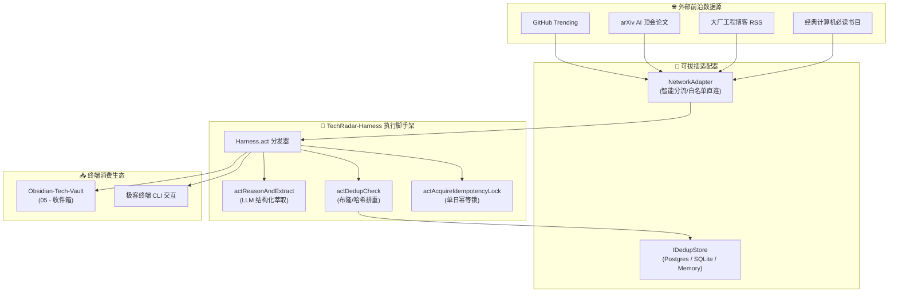

# 🚀 示例：TechRadar 智能体工程架构设计 PRD

> 💡 **范例说明**：本文件为 `01 - 项目介绍` 的标准工程设计样本，展示如何结合 PRD 目标、领域模型、架构拓扑与交付里程碑来沉淀业务与技术资产。

---

## 🎯 一、核心目标与痛点背景

### 1.1 业务背景
传统技术资讯获取方式零散脆弱：开发者每天需要耗费大量时间反复刷新 GitHub Trending、arXiv 论文和各大技术博客，且充斥着无效噪音与软文公关。

### 1.2 核心愿景 (North Star)
打造一套**全自动、高信噪比、类型安全**的自主技术情报雷达智能体脚手架（Harness 模式），实现：
1. **全天候自治抓取**：定时采集四大前沿源流；
2. **AI 深度结构化萃取**：基于 Zod Schema 严格提取底层突破与工程启示；
3. **第二大脑无缝沉淀**：自动落地为标准 Markdown 知识库收件箱文档并打卡。

---

## 🏛️ 二、分层解耦架构拓扑 (Layered Architecture)

---

## 📋 三、交付物里程碑 (Milestones)

- [x] **v1.0.0 Alpha**：完成 TypeScript 重构与 Harness 统一动作分发器；
- [x] **v1.1.0 Beta**：实现 PostgreSQL 与 SQLite 双驱动无缝热插拔；
- [ ] **v1.2.0 GA**：接入更多学术垂直数据源并支持 Telegram/飞书群机器人实时推送。
