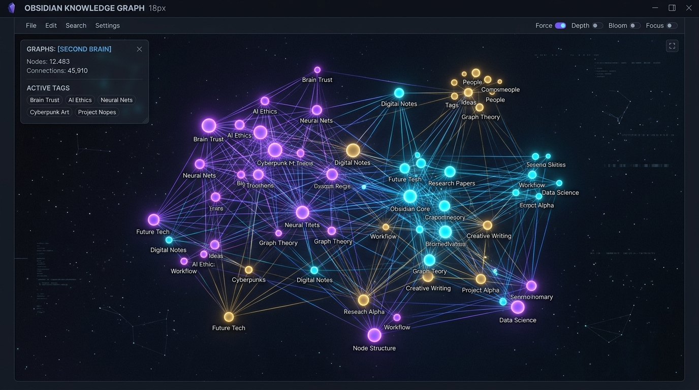

<div align="center">

```
  ████████╗███████╗ ██████╗██╗  ██╗    ██╗   ██╗ █████╗ ██╗   ██╗██╗  ████████╗
  ╚══██╔══╝██╔════╝██╔════╝██║  ██║    ██║   ██║██╔══██╗██║   ██║██║  ╚══██╔══╝
     ██║   █████╗  ██║     ███████║    ██║   ██║███████║██║   ██║██║     ██║   
     ██║   ██╔══╝  ██║     ██╔══██║    ╚██╗ ██╔╝██╔══██║██║   ██║██║     ██║   
     ██║   ███████╗╚██████╗██║  ██║     ╚████╔╝ ██║  ██║╚██████╔╝███████╗██║   
     ╚═╝   ╚══════╝ ╚═════╝╚═╝  ╚═╝      ╚═══╝  ╚═╝  ╚═╝ ╚═════╝ ╚══════╝╚═╝   
```

# 🧠 Obsidian-Tech-Vault (面向技术人员的现代 Obsidian 知识库模板)

> ⚡ **专为软件工程师、AI/Agent 开发者、算法架构师与技术研究者打造的专业第二大脑**  
> 融合 Johnny Decimal 十进制分类法、PARA 敏捷流与 12 套生产级 Markdown 模板，内建立体 MOC 知识图谱，原生适配自动化智能体生态。

[English](README.md) | **简体中文**

[](https://github.com/dora-exploreLab/obsidian-tech-vault)
[](https://opensource.org/licenses/MIT)
[](https://github.com/dora-exploreLab)
[](https://github.com/dora-exploreLab/obsidian-tech-vault/pulls)

<br/>



</div>

---

## 🌟 为什么选择 Obsidian-Tech-Vault？

大多数开发者在使用 Obsidian 时，都会面临“面对空白文件夹无从下手”的困境。  
本模板提炼自高级工程师与 AI 架构师的真实知识管理实践，具备以下核心特性：

1. **科学清晰的 10 级目录骨架**：
   - 采用 **Johnny Decimal 编号法 + PARA 工作流**，职责清晰，绝不陷入深层文件夹迷宫。
2. **12 套生产级工业标准化模板**：
   - 涵盖从每日复盘、架构设计、大模型训练、Agent 智能体系统，到顶会论文精读与敏捷看板全场景。
3. **原生适配自动化技术雷达生态**：
   - `05 - 收件箱/` 目录结构与开源项目 [**`tech-radar-agent`**](https://github.com/dora-exploreLab/tech-radar-agent) 原生无缝对接，全天候全自动沉淀全网技术趋势！

---

## 🗂️ 知识库十级目录架构全景

```text
obsidian-tech-vault/
├── 00 - 个人说明/          # 👤 开发者技术画像、技能矩阵与知识库维护手册
├── 01 - 项目介绍/          # 🚀 业务工程架构、技术选型与交付物清单
├── 02 - 学习规划/          # 📚 长期技术演进路线图、深度攻坚主题与课程打卡
├── 03 - 待办事项/          # 📌 GTD 待办清单、今日三只青蛙与看板池
├── 04 - 周期复盘/          # 📅 Daily 工作流水、周度敏捷回顾、月度战略总结
├── 05 - 收件箱/            # 📥 自动化雷达归档池（技术快讯、文献精选、技术专栏）
├── 06 - 知识图谱/          # 🕸️ MOC 拓扑与双向链接：立体知识星系、永久概念与思维模型
├── 07 - 手册资料/          # 🧰 API 速查表、实用手册与经典好书精读
├── 08 - 深度专题/          # 📐 专项技术攻坚、系统级测试与学术研究
└── Templates/              # 🌟 12 套开箱即用标准化 Markdown 模板全家桶
```

---

## 📋 12 套标准化 Markdown 模板一览

| 模板文件名 | 适用场景 |
| :--- | :--- |
| **`模板-01-每日工作复盘`** | 今日三只青蛙、开发流水、学习收获与反思复盘 |
| **`模板-02-前端架构与组件设计`** | 现代全栈架构、组件拆分、状态流与性能考量 |
| **`模板-03-服务器与运维隧道配置`** | 云服务器跳板机、反向代理、内网穿透与安全白名单 |
| **`模板-04-大模型与微调训练`** | LLM 训练超参、微调数据集清洗、显存与 Loss 评估 |
| **`模板-05-Agent智能体系统设计`** | 规划器、记忆层、工具执行、MCP 协议与协作拓扑 |
| **`模板-06-AI前沿论文与研读`** | 核心突破机制、算法流程、实验对比与复现启示 |
| **`模板-07-知识图谱节点`** | MOC 拓扑中心/原子概念节点、双向链接网状沉淀与底层本质 |
| **`模板-08-项目规划与复盘`** | PRD 目标、技术选型、时间线与交付回顾 |
| **`模板-09-技术方案评审与会议`** | 方案背景、争议讨论点、会议决议与 Action Items |
| **`模板-10-每日待办清单`** | 轻量级每日 GTD 打卡清单 |
| **`模板-11-月度计划与任务看板`** | 月度 OKR、阶段里程碑与看板泳道 |
| **`模板-12-周度敏捷复盘`** | 本周亮点、交付复盘、阻塞卡点与下周排期 |

---

## 🏛️ 底层方法论大厦：为什么这样设计？

市面上绝大多数知识库模板最终沦为“数字废墟”的根因，在于它们只是僵化的文件夹堆叠，**缺乏人类认知科学与现代项目管理理论的灵魂支撑**。

`Obsidian-Tech-Vault` 将经过全球科学界与工程界百年检验的 **7 大经典思想体系**，深度编织进十级架构的每一个细胞：

| 理论大师与学术流派 | 核心思想体系 | 知识库架构落地映射 | 赋能价值 |
| :--- | :--- | :--- | :--- |
| **Simon Sinek** (管理学大师) | **Golden Circle (黄金圈法则)** | `00 - 个人说明` | 确立 `Start with WHY`：先定长期使命与护城河，再定技术栈，拒绝盲目跟风 |
| **Tiago Forte** (第二大脑之父) | **CODE 认知漏斗 & PARA 框架** | `01 项目` / `05 收件箱` | 笔记必须服务于行动交付（Actionability），通过 Capture ➡️ Distill 驱动高产出 |
| **德雷福斯兄弟 & 刻意练习** | **Dreyfus 技能进阶模型** | `02 - 学习规划` | 从新手到大师设定阶梯式里程碑，杜绝无效低水平重复刷课 |
| **David Allen** (现代时间管理之父) | **GTD (Getting Things Done)** | `03 - 待办事项` | “大脑是用来思考的，不是用来存待办的”。清空工作记忆，聚焦今日三只青蛙 |
| **Ken Schwaber & Jeff Sutherland** | **Scrum 敏捷冲刺与 Retrospective** | `04 - 周期复盘` | 放弃假大空流水账，采用工业级周度敏捷三问（亮点、卡点、Action Items） |
| **Niklas Luhmann** (德国当代社会学家) | **Zettelkasten (卡片盒笔记法)** | `06 - 知识图谱` | 原子化思考与双向链接网络，让离散灵感在 MOC 引力星云中自下而上涌现 |
| **Cal Newport** (认知科学家/计算机教授) | **Deep Work (深度工作心流)** | `08 - 深度专题` | 设立高信噪比纯净空间，阻断碎片化打扰，攻坚技术白皮书与大型架构推演 |
| **Richard Feynman** (诺贝尔物理学奖得主) | **费曼学习法 (Feynman Technique)** | `模板-07 知识图谱节点` | 内建 `ELIF (Explain Like I'm 5)` 模块，逼迫自己用大白话讲透底层原理 |

---

## 🛡️ 防弃坑：认知负荷最小化循环 (The Low-Friction Daily Loop)

很多开发者抱怨：“知识库太重了，坚持两周就荒废了。”  
本模板开创性地设计了**分层低摩擦心流**，让知识维护像呼吸一样自然无感：

* **🟢 日常无感流 (Daily: 3 分钟/天)**：
  - 仅打开 `04 - 周期复盘/Daily/`，写下「今日最重要的 3 只青蛙」；
  - 外部技术雷达由 [`tech-radar-agent`](https://github.com/dora-exploreLab/tech-radar-agent) 全天候自动抓取并注入 `05 - 收件箱`，无压零负担。
* **🟡 周末敏捷流 (Weekly: 15 分钟/周)**：
  - 唤醒 `模板-12-周度敏捷复盘`，勾选本周核心战役与交付物清单；
  - 快速总结 1 个亮点与 1 个改进点，生成下周待办 Sprint Backlog。
* **🟣 深度涌现流 (On-Demand: 灵感爆发或重大攻坚时)**：
  - 按需调用 `模板-07-知识图谱节点`，用费曼大白话萃取本质概念；
  - 按 `Ctrl + G` (macOS: `Cmd + G`) 点亮知识星系图谱，享受第二大脑网状生长的自涌现美感！

---

## 🕸️ 知识图谱 (Graph View) 探索漫游

本模板在 `06 - 知识图谱/` 中内建了立体网状拓扑：
* **一级中枢 (Master MOC)**：`06.00 - 核心知识图谱全局中枢`，知识库的宇宙核心；
* **二级领域星系 (Domain MOC)**：
  - `06.10 - 人工智能与智能体图谱 (AI & Agent MOC)`
  - `06.20 - 系统架构与分布式图谱 (Architecture MOC)`
  - `06.30 - 算法与认知思维模型 (Mental Models MOC)`
* **互联概念节点**：预置 `Agent Harness`、`ReAct`、`MCP`、`分布式幂等锁`、`现代网络分流`、`Zettelkasten` 等高度互联的双向链接节点。
* **快捷唤醒**：在 Obsidian 中按下 `Ctrl + G` (macOS: `Cmd + G`)，即刻查看点亮浩瀚知识星系的关系图谱！

---

## 🚀 快速上手 (30秒开箱即用)

### 方式一：GitHub 模板一键派生 (推荐)
1. 点击本仓库右上角醒目的绿色大按钮：**`Use this template` ➡️ `Create a new repository`**；
2. 命名为你的个人知识库仓库（如 `my-knowledge-vault`）；
3. 打开 Obsidian 客户端 ➡️ 选择 **“打开本地已存在的文件夹 (Open folder as vault)”** ➡️ 选中克隆目录即可！

### 方式二：Git 本地克隆
```bash
git clone https://github.com/dora-exploreLab/obsidian-tech-vault.git my-vault
```

---

## 🔌 强烈推荐的 Obsidian 极客插件清单

为了获得极致的联动体验，建议在 Obsidian 社区插件中安装：
* **Dataview**：以 SQL 风格动态聚合你的项目、待办与笔记元数据；
* **Templater / Templates**：快捷键一键插入 `Templates/` 目录下的 12 套模板；
* **Kanban**：将 `03 - 待办事项/` 渲染为 Trello 风格的精美看板；
* **Omnisearch**：全库毫秒级深度全文与中英文智能检索。

---

## 🤖 智能体自动化联动

搭配我们开源的 **[`tech-radar-agent`](https://github.com/dora-exploreLab/tech-radar-agent)**：
* 每日凌晨全自动爬取 GitHub Trending、ArXiv 论文和大厂技术博客；
* 深度提炼后直接落盘至本仓库的 **`05 - 收件箱/`**，并在待办清单中自动打勾，打造真正自运转的第二大脑！

---

## 👥 核心作者与共建团队 (Authors & Contributors)

* 🧑‍💻 **[dorabighead](https://github.com/dorabighead)** (Lead Architect & Maintainer)
  - 架构总览、个人知识管理体系顶层设计、领域思维模型萃取与开源生态主理。
* 🤖 **[AGY (Antigravity Agent)](https://github.com/dora-exploreLab)** (Autonomous AI Co-Developer)
  - 7 大经典社会科学与敏捷项目管理方法论深度融入、MOC 拓扑知识图谱立体化工程构建、防弃坑低摩擦心流体系设计。

---

## 📄 开源许可证

本项目基于 [MIT License](LICENSE) 协议完全开源。